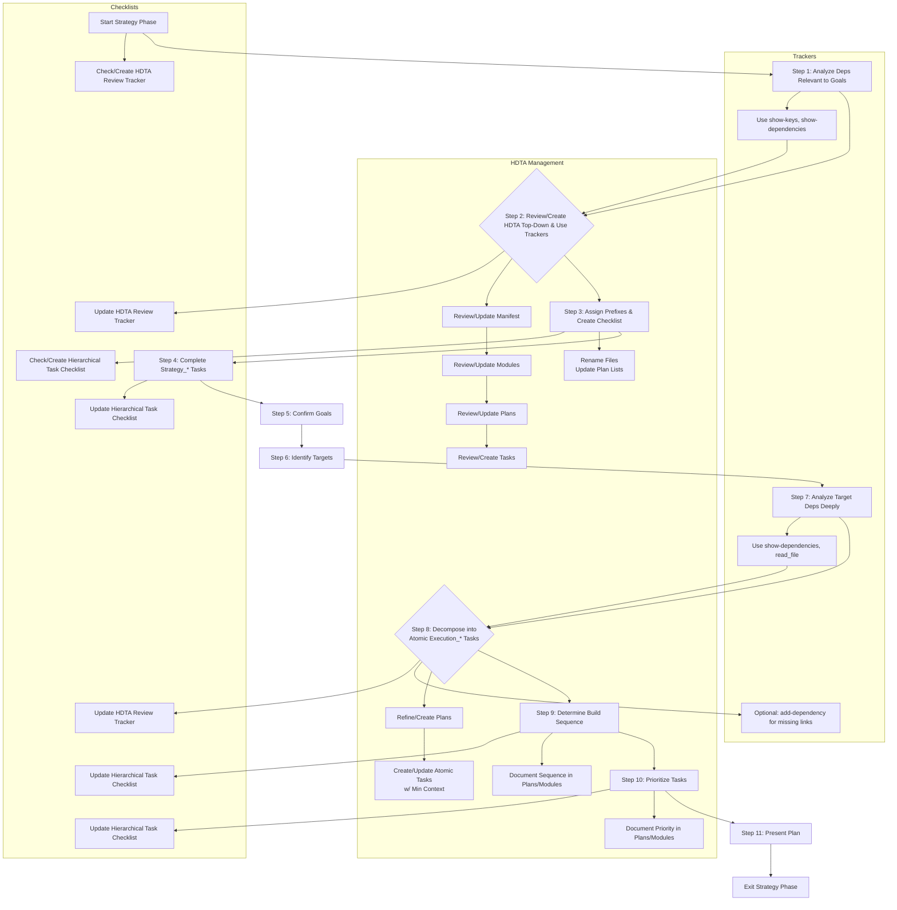

# **Cline Recursive Chain-of-Thought System (CRCT) - Strategy Plugin**

This Plugin provides detailed instructions and procedures for the Strategy phase of the CRCT system. It guides the critical, exhaustive process of translating the high-level system design into a fully sequenced and actionable implementation plan based on **verified** project dependencies. *All* planning, from top-level modules to granular tasks, must be completed before transitioning to Execution.
Use this in conjunction with the Core System Prompt.

**Entering and Exiting Strategy Phase**

**Entering Strategy Phase:**
1.  **`.clinerules` Check (Mandatory First Step)**: Read `.clinerules` file content.
2.  **Determine Current State**:
    *   If `[LAST_ACTION_STATE]` indicates `current_phase: "Strategy"`, proceed with the instructions below, resuming from the action indicated by `next_action`.
    *   If `[LAST_ACTION_STATE]` indicates `next_phase: "Strategy"`, this signifies a transition from a previous phase (likely Set-up/Maintenance). Proceed with the instructions below, starting from **Section II, Step 0**.
3.  **User Trigger**: If starting a new session and `.clinerules` indicates the system *was* in Strategy or *should transition* to Strategy, proceed with these instructions.

**Exiting Strategy Phase:**
1.  **Completion Criteria (Mandatory Check)**: Verify ALL the following are met:
    *   A comprehensive implementation sequence based on dependency analysis has been defined for all planned work (documented in Implementation Plans or respective `*_module.md` files).
    *   All high-priority work planned for this strategy cycle has been decomposed into atomic Task Instructions (`*.md`), with clear phase prefixes (`Strategy_*`, `Execution_*`).
    *   All necessary HDTA documents (System Manifest, Domain Modules, Implementation Plans, Task Instructions) have been created or updated according to the plan, with no placeholders or incomplete sections relevant to the planned work.
    *   `Execution_*` tasks have been sequenced and prioritized (documented in Implementation Plans or respective `*_module.md` files).
    *   All HDTA documents are correctly linked (Tasks from Plans, Plans from Modules, Modules from Manifest).
    *   All `Strategy_*` tasks identified during this phase have been completed.
    *   The `hierarchical_task_checklist_[cycle_id].md` reflects the completed planning state.
2.  **`.clinerules` Update (Mandatory MUP Step)**: If completion criteria are met, update `.clinerules` `[LAST_ACTION_STATE]` **exactly** as follows:
    ```
    last_action: "Completed Strategy Phase: Defined Implementation Sequence and Prioritized Tasks"
    current_phase: "Strategy"
    next_action: "Phase Complete - User Action Required"
    next_phase: "Execution"
    ```
3.  **Pause for User Action**: After successfully updating `.clinerules`, state that the Strategy phase is complete and you are awaiting user action (e.g., a new session start) to begin the Execution phase. Do not proceed further in this session. Refer to Core System Prompt, Section III for the phase transition checklist.

## I. Phase Objective & Guiding Principles

**Objective**: To create a comprehensive, dependency-aware **implementation roadmap** that spans all modules and files targeted for the current development cycle. This exhaustive process involves reviewing and creating all necessary HDTA documentation **following a strict top-down hierarchy**, completing all `Strategy_*` tasks, systematically decomposing goals, rigorously analyzing dependencies and their underlying meaning, sequencing granular tasks with appropriate phase prefixes (`Strategy_*`, `Execution_*`), determining the correct build order based on verified dependencies, and prioritizing work for the Execution phase. All planning for the targeted work must be completed before moving forward.

**CRITICAL FIRST STEP**: Before any planning or decomposition, you MUST analyze existing dependencies using `show-keys` and `show-dependencies` commands (see Section II, Step 1).
**Failure to check dependencies at the start of this phase is a CRITICAL FAILURE**, as it risks generating inaccurate plans that ignore the system's foundational relationships, leading to project failure.

**Guiding Principles**:
1.  **Mandatory Dependency Analysis (CRITICAL FIRST STEP)**: Before any strategic planning or HDTA document creation/review, analyze existing dependencies using `show-keys` to identify areas needing verification (if Set-up/Maintenance wasn't fully completed) and `show-dependencies` to understand relationships across all relevant trackers (`doc_tracker.md`, mini-trackers, `module_relationship_tracker.md`). **Failure to perform this step is a CRITICAL FAILURE**, as the CRCT system relies on dependency knowledge to sequence tasks correctly and avoid catastrophic planning errors. This is not optional—it is the foundation of your roadmap.
2.  **Exhaustive HDTA Review and Creation (Strict Top-Down)**: All HDTA documentation must be reviewed for accuracy and completeness **respecting the hierarchy: System Manifest -> Domain Modules -> Implementation Plans -> Task Instructions.** Only AFTER understanding the context from a higher level should you proceed to review or create documents at the next level down. **Deviating from this top-down flow is a violation of CRCT principles and will lead to fragmented planning.** If any document is missing for the planned work, create it using the appropriate template *at the correct point in the top-down flow*. Ensure documents have no placeholders or incomplete sections relevant to the plan.
3.  **Dependency-Driven Sequencing**: Verified relationships ('<', '>', 'x', 'd') in trackers, understood through `show-dependencies` and file content analysis, are the **primary guide** for determining task order.
4.  **Plan Top-Down, Build Bottom-Up**: Define the strategy starting from high-level goals (informed by `system_manifest.md`, `progress.md`, `activeContext.md`) and progressively decompose them through Domain Modules, Implementation Plans, and finally into specific Tasks, **always reading/creating documents in that hierarchical order.** Execution order is determined by starting with foundational tasks (those with no unmet dependencies) and building upwards.
5.  **Strategic HDTA Creation**: HDTA documents are the **structured output of the strategic planning process**, capturing objectives, steps, context, and dependencies. Create or update them *as needed* to define the plan for the targeted work.
6.  **Clear Phase Labeling**: Tasks must be prefixed with `Strategy_*` (for planning tasks completed in this phase) or `Execution_*` (for implementation tasks passed to the Execution phase).
7.  **Minimal Context, Maximum Guidance**: Create clear, concise Task Instructions that provide the Execution phase with necessary guidance and *minimal* context links without unnecessary detail.
8.  **Focused Planning**: While comprehensive for the *target* features/modules of the cycle, ensure the plan is focused and achievable within a reasonable timeframe. Defer unrelated work if necessary.

## II. Strategic Planning Workflow: Defining the Implementation Roadmap

**Directive**: Develop a comprehensive implementation roadmap by reviewing and creating all HDTA documentation **strictly following the top-down hierarchy (Manifest -> Module -> Plan -> Task)**, completing all `Strategy_*` tasks, systematically decomposing goals, rigorously analyzing dependencies and their underlying meaning, sequencing granular tasks with appropriate phase prefixes, and prioritizing work for focused execution. This is an exhaustive process covering all targeted areas for the cycle.

**Procedure**:

*   **Check for Unarchived Tracker Files**: Before beginning this Strategy cycle's planning, quickly review the `{memory_dir}/` directory for any `hdta_review_progress_*.md` or `hierarchical_task_checklist_*.md` files from previous cycles that were not archived during Cleanup/Consolidation. If found, note any tasks not completed for transfer to new files for this cycle. Otherwise mark these files for the next Cleanup/Consolidation phase as a persistent step in activeContext. Proceed with creating new tracker files for the current cycle as instructed below. State: "Checked for unarchived tracker files. Found: [List found files, or 'None']."


0.  **Identify and Confirm Strategy Cycle Goals.**
    *   **Directive:** Before any dependency analysis or detailed planning, clearly define the scope and primary goals for *this specific* Strategy cycle. This ensures all subsequent planning and analysis are focused on the relevant areas.
    *   **Action:** Read `activeContext.md`, `system_manifest.md`, `progress.md`, and `hdta_review_progress_*.md` or `hierarchical_task_checklist_*.md` if present to understand the overall project status, previous actions, and potential areas for focus.
    *   **Action:** Explicitly state the proposed goals and target areas (modules, features, etc.) for this cycle based on the review. Identify which Domain Modules, Implementation Plans, or specific code/doc files are likely to be involved.
    *   **Action:** If the goals are unclear or require user input, use `ask_followup_question` to get clarification.
    *   **Action:** Update `activeContext.md` to clearly document the confirmed goals and target areas for this Strategy cycle. State: "Identified/Confirmed goals for this Strategy cycle: [List of goals]. Target areas: [List of target areas]."
    *   **State:** "Completed identification of Strategy cycle goals. Proceeding to analyze relevant dependencies."

1.  **Analyze Dependencies Relevant to Goals.**
    *   **CRITICAL STEP**: This step focuses the mandatory dependency analysis on the goals identified in Step 0. Failure to base planning on relevant dependency knowledge is a CRITICAL FAILURE, as it risks misaligned sequences and broken implementations.
    *   **Directive:** Analyze existing dependencies to understand the relationships specifically within and between the target areas identified in Step 0, grounding planning in *relevant* system constraints.
    *   **Action:** Identify keys (using `cline_utils\dependency_system\core\global_key_map.json` to find files within target directories) that correspond to the target areas defined in Step 0.
    *   **Action**(Optional, use if global key map is unavailable or keys for a specific tracker are needed): Use `show-keys --tracker <tracker_file_path>` on the trackers (`doc_tracker.md`, `module_relationship_tracker.md`, and relevant mini-trackers within target areas) *specifically focusing on the identified keys*. Note any keys that still show `(checks needed: p, s, S)` within the scope of the current goals; these may require verification if critical to the plan.
    *   **Action**: For each key of interest *within the target areas*, use `show-dependencies --key <key>` to review all incoming and outgoing dependencies. State: "Executed `show-dependencies --key {key}`. Reviewed dependencies: `{summary_of_relationships}`."
    *   **Deep Understanding**: For dependencies ('<', '>', 'x', 'd') *within the scope of the goals*, use `read_file` to examine the content of related files. Ask and document:
       - *Why* does A depend on B? (Function call, data structure, conceptual prerequisite?)
       - What *specific* parts of B are relevant to A?
       - What is the *implication* for implementation order and refactoring?
       State: "Deepened analysis of dependencies relevant to `{target_area}`. Confirmed `{key_a}` requires `{key_b}` due to `{detailed_reason}`. Sequencing implication: Implement `{key_b}` task first."
    *   **Clarification:** The primary purpose of this step is to understand the *existing relationships relevant to the plan*, not necessarily to perform a comprehensive re-verification of all project dependencies if Set-up/Maintenance is assumed complete. However, be mindful of unverified dependencies (`p`, `s`, `S`) that impact the target areas.
    *   **State:** "Completed analysis of dependencies relevant to target areas [List of areas]. Key relationships identified: [Summary]. Proceeding to HDTA documentation review."

2. **Review and Create HDTA Documentation (Strict Top-Down Order) & Use HDTA Review Progress Tracker**:
   * **Directive**: Review, update, or create all necessary HDTA documents **strictly following the top-down hierarchy (System Manifest -> Domain Modules -> Implementation Plans -> Task Instructions)** for the target areas identified in Step 0. Use the HDTA Review Progress Tracker to manage this process.
   * **Action**: Before starting the review, ensure the HDTA Review Progress Tracker (`hdta_review_progress_[session_id].md`) for the current session is initialized or updated. Check for existing `hdta_review_progress_*.md` files in `{memory_dir}/`. If found, note their existence but proceed with using or creating the tracker for the *current* session as specified below.
   * **Use HDTA Review Progress Tracker**:
       * **Initialization**: At the start of the Strategy phase or a new session targeting new work, create a fresh copy of `cline_docs/templates/hdta_review_progress_template.md` as `hdta_review_progress_[session_id].md`. State: "Checked for existing HDTA Review Progress Trackers. Found: [List found files, or 'None']. Created HDTA Review Progress Tracker as `hdta_review_progress_[session_id].md` for the current session."
       * **Logging Progress**: After reviewing, updating, or creating each HDTA document, update the corresponding entry in the tracker:
      - Mark the appropriate status checkbox (Not Reviewed / Reviewed / Updated / Created).
      - Add brief notes summarizing findings or actions taken (e.g., "Updated dependencies section" or "Created from template with full content").
      - Record the date/time of the last action.
      - State: "Updated HDTA Review Progress Tracker for `{file_path}` with status `{status}` and notes `{notes}`."
   * **Avoid Redundancy**: Before reviewing any document, check the tracker to see if it has already been marked as "Reviewed" or "Updated" in this session. If so, skip unless new information or changes necessitate a re-review (e.g., dependency updates or relevance to newly defined goals). State: "Skipped review of `{file_path}` as it is already marked as `{status}` in the HDTA Review Progress Tracker."
   * **Session Summary**: At the end of the session or upon completing this step, update the "Completion Summary" section of the tracker with counts of reviewed/updated/created documents, list pending documents, and outline next steps. State: "Completed HDTA review step. Updated Completion Summary in `hdta_review_progress_[session_id].md` with pending items and next steps."
   * **System Manifest First**: Always start by reading/reviewing `system_manifest.md`. Ensure it accurately reflects the high-level architecture and lists known Domain Modules relevant to the goals. Update if necessary. State: "Starting HDTA review with `system_manifest.md`."
   * **Domain Modules Next**: For the target area(s) of focus (or all modules if doing a full review), read/review the relevant `*_module.md` files linked from the manifest. Check for completeness, accuracy, and links to Implementation Plans. Create or update as needed *based on manifest context and relevance to goals*. State: "Proceeding to review Domain Module `{module_name}_module.md`."
   * **Implementation Plans Then**: For each relevant Domain Module within the target area, read/review its linked `implementation_plan_*.md` files. Check for clear objectives, affected components, high-level steps, and links to Task Instructions. Create or update *based on module context and relevance to goals*. State: "Proceeding to review Implementation Plan `{plan_name}.md`."
   * **Task Instructions Last**: Only *after* understanding the context from the parent Implementation Plan and its relevance to the goals should you review, create, or update specific Task Instruction files (`*.md`). Ensure they have clear atomic objectives, steps, minimal context links, and dependencies. State: "Proceeding to review/create Task Instruction `{task_name}.md` based on parent plan `{plan_name}.md` and cycle goals."
   * **CRITICAL WARNING**: Do NOT jump directly to creating or reviewing Task Instructions without first processing the higher levels (Manifest, Module, Plan) and confirming relevance to the cycle goals. This breaks the recursive decomposition flow and risks creating tasks disconnected from the overall strategy and context. **Adherence to the top-down hierarchy and goal relevance is mandatory.**
   * **General Action**: For each document level, follow the Existence Check -> Accuracy/Completeness Check -> Create/Update logic as previously defined, but ensure you process documents in the strict hierarchical order described above and prioritize based on relevance to the cycle's goals.
      * **For Each Document**:
         * **A. Existence Check**: Verify if the document exists for each required HDTA tier (System Manifest, Domain Modules, Implementation Plans, Task Instructions) *within the scope of the cycle's goals*.
            * If missing: State "File `{file_path}` does not exist. Creating using template." Use the appropriate template from `cline_docs/templates/` (e.g., `system_manifest_template.md`, `module_template.md`, `implementation_plan_template.md`, `task_template.md`) and create the document with all required sections filled, focusing on the cycle's goals.
            * If exists: State "File `{file_path}` exists. Reviewing for accuracy and completeness based on cycle goals."
            * If incomplete or outdated: State "File `{file_path}` exists but needs updates for the cycle's goals. Updating." Update using the template structure, preserving valid content and filling in missing details related to the goals.
            * If complete and accurate: State "File `{file_path}` is complete and accurate for cycle goals. No update needed."
         * **C. Create/Update**: If creation or update is needed, use `write_to_file` to save the document, ensuring all required sections are filled based on the template, dependency analysis from Step 1, and the cycle's goals.
   * **Action**: Ensure `system_manifest.md` includes all relevant Domain Modules (for the goals), and each relevant Domain Module links to its Implementation Plans, which in turn link to Task Instructions.
   * **Action**: Verify that all HDTA documents relevant to the cycle's goals are free of placeholders and fully specify objectives, steps, dependencies, and context links *within that scope*.
   * **Add Missing Dependency Links**: While defining HDTA documents, if you identify crucial dependency links (especially code-to-doc) that were missed during Set-up/Maintenance and are necessary for context *for the current plan*, use `add-dependency` to add them to the appropriate tracker (usually the mini-tracker for the code file). State your reasoning clearly.

3. **Review and Assign Task Prefixes & Create Hierarchical Task Checklist**:
   * **Action**: Scan all Task Instructions *relevant to the cycle's goals* for unprefixed tasks (e.g., `task_name.md` instead of `Strategy_task_name.md` or `Execution_task_name.md`).
      * For each unprefixed task:
         * Analyze the task’s content to determine its purpose in relation to the cycle goals.
         * Assign the appropriate prefix:
            * `Strategy_*`: For tasks involving planning, decomposition, or HDTA document creation/updates (to be completed in this phase).
            * `Execution_*`: For tasks involving code implementation, file modifications, or other execution steps (to be completed in the Execution phase).
         * Rename the file to include the prefix (e.g., `task_name.md` → `Strategy_task_name.md` or `Execution_task_name.md`).
         * State: "Task `{task_name}` lacks prefix. Analyzed and assigned prefix `{Strategy_|Execution_}` based on cycle goals. Renamed to `{new_file_name}`."
   * **Action**: List all tasks with their assigned prefixes in the respective `implementation_plan_*.md` or `*_module.md` file for clarity, ensuring these are the plans/modules relevant to the cycle goals.

*   **Create and Use Hierarchical Task Checklist**:
   * **Initialization**: After completing HDTA documentation review (Step 2) and task prefix assignment, create a comprehensive `hierarchical_task_checklist.md` using the `hierarchical_task_checklist_template.md` from `cline_docs/templates/`. Check for existing `hierarchical_task_checklist_*.md` files in `{memory_dir}/`. If found, note their existence but proceed with creating a new checklist for the *current* cycle as specified below.
      - Populate the checklist with the full hierarchy of Domain Modules, Implementation Plans, and Task Instructions **relevant to the cycle's goals** based on `system_manifest.md` and related HDTA documents.
      - Save the file as `hierarchical_task_checklist_[cycle_id].md` (replace `[cycle_id]` with a unique identifier for the current planning cycle or session, perhaps derived from the date/time).
      - State: "Checked for existing Hierarchical Task Checklists. Found: [List found files, or 'None']. Created Hierarchical Task Checklist as `hierarchical_task_checklist_[cycle_id].md` with project structure *relevant to cycle goals* for progress tracking."
   * **Tracking Progress**: As tasks, plans, or modules are completed (e.g., after Step 4: Complete Strategy_* Tasks, or during sequencing and prioritization in later steps), update the checklist by marking completed items with `[x]`.
      - State: "Updated Hierarchical Task Checklist: Marked `{item_name}` as completed."
   * **Guiding Workflow**: Use the checklist to visually identify the next pending task or area of focus based on the hierarchy and dependency sequence. Prioritize tasks marked as incomplete, especially those unblocking others *within the cycle's goals*.
      - Periodically update the "Progress Summary" section with counts of completed items, next priority tasks, and any notes on blockers related to the cycle goals.
      - State: "Reviewed Hierarchical Task Checklist. Next priority task identified as `{task_name}` based on sequence and dependency analysis, relevant to cycle goals."
   * **Avoid Loops**: If unsure of the next action, refer to the checklist to confirm pending items rather than re-analyzing completed sections. State: "Consulted Hierarchical Task Checklist to avoid redundant analysis. Proceeding with next pending item `{item_name}` relevant to cycle goals."

4. **Complete Strategy_* Tasks**:
   * **Action**: Identify and execute all tasks prefixed with `Strategy_*` listed in the Hierarchical Task Checklist.
      * **Prioritization**: Complete these tasks before proceeding to further planning steps, as they may involve critical planning or decomposition work.
      * **Execution**: For each `Strategy_*` task:
         * Read the task’s instructions and follow its steps.
         * Update or create HDTA documents as specified.
         * Mark the task as complete in its file and in the respective `implementation_plan_*.md` or `*_module.md` file.
         * State: "Completed `Strategy_{task_name}`. Updated `{affected_files}`."
      * **Verification**: Ensure no `Strategy_*` tasks remain incomplete before proceeding.
      * State: "All `Strategy_*` tasks completed. Proceeding with roadmap development."

5. **Confirm Understanding of Current State & Goals**:
   * **Action**: Refer back to the information gathered during initialization and Step 0. Briefly summarize or confirm your understanding of the primary goals for this planning cycle based on `activeContext.md`, `system_manifest.md`, and `progress.md`. State: "Confirmed understanding of cycle goals: {brief summary}."

6. **Identify Target Area(s)**:
   * **Action**: Based on Step 5, explicitly state the primary module(s) or feature(s) selected as the focus for this planning cycle. Ensure all modules are covered in the roadmap.

7. **Analyze Dependencies & Understand Interactions**:
   * **CRITICAL STEP**: This step builds on the mandatory analysis done in Step 1. If you have not completed Step 1, stop immediately and return to it. **Failure to base planning on dependency knowledge is a CRITICAL FAILURE**, as it risks misaligned sequences and broken implementations.
   * **Action**: For all target areas identified in Step 6, deepen your understanding of interactions using the dependency system *before* detailed planning. Revisit `show-dependencies --key <relevant_key>` for key files or modules involved (e.g., main module key like `1Ba`, or specific file key like `1Ba2`) if needed. State: "Revisited dependencies for `{key}` to confirm planning constraints: `{summary_of_relationships}`."
   * **Interpret & Document**: Analyze *why* dependencies exist and the *implications* for implementation order within the target area.
      * `Depends On ('<')`: Files/modules listed are **prerequisites**. Work cannot start until these are complete.
         * When show-dependencies returns '<' relationship:
            1. Read source/target files via `read_file`.
            2. Perform line-level analysis (function/method calls, class inheritance, documentation references).
            3. Confirm relationship type matches actual usage.
      * `Depended On By ('>')`: Files/modules rely on the key. Changes may impact downstream components.
      * `Documentation ('d')`: Indicates essential documentation links. Ensure linked docs are created/updated.
      * `Mutual ('x')`: Suggests tightly coupled components needing coordinated development or careful sequencing.
   * Review `doc_tracker.md`, mini-trackers (`*_module.md`), and `module_relationship_tracker.md` using `show-keys` and `show-dependencies` to confirm relationships.
   * **MANDATORY: Deepen Understanding**: Use `read_file` to examine the *content* of files associated with dependencies ('<', '>', 'x', 'd'). Ask:
      * *Why* does A depend on B? (Function call, data structure, conceptual prerequisite?)
      * What *specific* parts of B are relevant to A?
      * What is the *implication* for implementation order and refactoring?
      State: "Deepened analysis of dependencies within `{target_area}`. Confirmed `{key_a}` requires `{key_b}` due to`{detailed_reason}`. Sequencing implication: Implement `{key_b}` task first."
   * **CRITICAL WARNING**: Skipping or skimming this step undermines the entire Strategy phase. **The CRCT system relies on your thorough understanding of dependencies to create a viable roadmap.** Ignoring this will lead to an unsuccessful project.
   * This understanding is essential for accurate decomposition and sequencing in subsequent steps.

8. **Decompose & Define HDTA Structure (Top-Down Planning, Atomic Tasks)**:
   * **Directive**: Based on goals and dependency understanding (Step 7), refine Implementation Plans and decompose work into the smallest logical, actionable **`Strategy_*` or `Execution_*` Task Instructions (`*.md`)**. Each task should be executable with limited context.
   * **Recursive Decomposition**: Break down work identified in Implementation Plans into the smallest logical, actionable units. The goal is to create **atomic Task Instructions (`*.md`)** with appropriate prefixes (`Strategy_*` or `Execution_*`) that can be executed independently by an LLM with a **limited context window**.
   *       Each Task Instruction should represent a single, focused change (e.g., implement one function, modify a specific class method, update a section of documentation).
   *   **Strategy Task Terminology**: Tasks involving planning, designing, defining, exploring, reviewing, or analyzing should typically be prefixed with `Strategy_*`.
   *   **Execution Task Terminology**: Tasks involving implementing, creating (code/scripts), integrating, coding, writing (tests), or modifying files should typically be prefixed with `Execution_*`.
      * Crucially, each Task Instruction file must explicitly list *only* the **minimal necessary context** (links to specific function definitions, relevant documentation keys/sections, data structures) required to complete *that specific task*, derived from your analysis. Avoid linking unnecessary files.
   * **HDTA Document Creation/Update**:
      * **Action**: For each required HDTA document (Domain Module, Implementation Plan, Task Instruction):
        * **A. Existence Check (Mandatory)**: Check if the target file path already exists.
        * **B. Decision & Rationale**:
            * If exists and current content is sufficient/accurate for the plan: State "File `{file_path}` exists and is sufficient. No update needed." Proceed to next document/step.
            * If exists but outdated/incomplete: State "File `{file_path}` exists but needs updates. Proceeding to update."
            * If not exists: State "File `{file_path}` does not exist. Proceeding to create."
        * **C. Create/Update**: If creation or update is needed, use `write_to_file`. Load the appropriate template from `cline_docs/templates/`. Fill in **all required sections** of the template with precise details based on your analysis.
     * **Specific Document Content Directives**:
        * **Domain Module (`*_module.md`)**: Required if planning involves a new major functional area or significant changes to an existing one. Use the template (`module_template.md`) to define its purpose, interfaces, and scope *within the context of the overall system and its dependencies*. If creating a new module, remember to manually add it to `system_manifest.md`.
        Include relevant **Implementation Details** (key files, algorithms, models planned *for this module*). List associated Implementation Plans.
        * **Implementation Plan (`implementation_plan_*.md`)**: Required for planning features or groups of related changes affecting multiple files. Use the template (`implementation_plan_template.md`) to outline the high-level approach, affected components (linking to their keys/docs), and major steps. Link this plan from the relevant Domain Module(s).
        Detail **Design Decisions**, **Algorithms**, and **Data Flow** relevant *to this specific plan*. List the sequence of atomic **Task Instructions** required to fulfill this plan.
        * **Task Instruction (`*.md`)**: Required for specific, actionable implementation steps within an Implementation Plan. Use the template (`task_template.md`) to detail the objective, **precise step-by-step instructions**, *minimal necessary context links*, **explicit `Dependencies` (Requires/Blocks task links)**, and expected output for *one atomic task*. Reference its parent Implementation Plan.
   * **Linking (Mandatory)**:
      * Add new Domain Modules to `system_manifest.md` registry.
      * Link Implementation Plans from their parent Domain Module.
      * Link Task Instructions from their parent Implementation Plan.
      * Fill the `Dependencies` (Requires/Blocks) section in Task Instructions.
   * **Add Missing Dependency Links**: While defining HDTA documents, if you identify crucial dependency links (especially code-to-doc) that were missed during Set-up/Maintenance and are necessary for context, use `add-dependency` to add them to the appropriate tracker (usually the mini-tracker for the code file). State your reasoning clearly.

9. **Determine Build Sequence (Bottom-Up Execution Order)**:
   * **Directive**: Sequence **atomic Task Instructions** based on dependencies analyzed in Step 7.
      * Identify foundational tasks/components: Those with no outgoing '<' dependencies within the current scope of work. These should generally be implemented first.
      * Sequence subsequent tasks: Order subsequent tasks ensuring prerequisites are met according to your understanding of the interactions (not just the characters). For 'x' dependencies, plan for potentially iterative or closely coordinated implementation steps across the linked tasks.

   * **Action**: Document the final sequence and rationale within the "Task Sequence / Build Order" section of the relevant Implementation Plan(s) or the module's `*_module.md` file. Update the Hierarchical Task Checklist to reflect sequence/readiness.

10. **Prioritize Tasks within Sequence**:
    * Within the determined build sequence, prioritize tasks based on:
       * Urgency/importance defined in `activeContext.md`.
       * Potential to unblock other tasks.
       * Logical grouping of related work.
    * Record the final prioritization order and explicit reasoning within the relevant Implementation Plan(s) or the module's `*_module.md` file.

11. **Present Plan**: Summarize the planned work (referencing Implementation Plans), the determined sequence/prioritization, key HDTA documents created/updated, and confirm readiness to exit the Strategy phase. Ensure the Hierarchical Task Checklist is up-to-date.

**Task Planning Flowchart**


## III. Strategy Plugin - Mandatory Update Protocol (MUP) Additions
**After Core MUP steps (Section VI of Core Prompt):**
* Save HDTA Documents: Ensure all new or modified Domain Modules, Implementation Plans, and Task Instructions created/updated during the action are saved using write_to_file.
* Update system_manifest.md: If new Domain Modules were created/defined, add links/references in the manifest.
* Update Linking HDTA Docs: Ensure Implementation Plans correctly link to their Task Instructions, and Domain Modules link to their Implementation Plans, reflecting any changes made.
* Update Checklists: Update `hdta_review_progress_[session_id].md` (initialized in Step 2) and `hierarchical_task_checklist_[cycle_id].md` (initialized in Step 3) to reflect the status of documents reviewed/updated and tasks defined/completed/sequenced.
* Update activeContext.md with Strategy Outcomes:
   * Summarize the planning actions taken.
   * Reference key HDTA documents created/updated.
   * Note progress in task decomposition, sequencing, and prioritization, referencing the detailed plans.
* Update .clinerules [LAST_ACTION_STATE]: Update to reflect the last significant planning action (e.g., "Completed Strategy_* tasks", "Defined Execution task sequence for Plan X", "Prioritized tasks for Module Y"). Use the specific exit state defined in Section I when the phase is complete.

## IV. Quick Reference
**Goal:** Create a comprehensive, dependency-aware implementation roadmap for targeted work, strictly following top-down HDTA processing.
**Key Actions:**
* Identify/Confirm Strategy Cycle Goals (Step 0).
* Analyze Dependencies Relevant to Goals (Step 1).
* Process HDTA Top-Down (Mandatory): Manifest -> Module -> Plan -> Task, relevant to goals (Step 2).
* Use hdta_review_progress_[session_id].md to track review status (Initialized in Step 2).
* Assign Strategy_* or Execution_* prefixes to tasks (Step 3).
* Create hierarchical_task_checklist_[cycle_id].md to track planning progress (Initialized in Step 3).
* Complete all Strategy_* tasks (Step 4).
* Analyze dependencies deeply (show-dependencies, read_file) (Step 7).
* Decompose goals into atomic Execution_* tasks (top-down planning) (Step 8).
* Define HDTA documents strategically (Step 8).
* Determine build sequence based on dependencies (bottom-up execution order) (Step 9).
* Prioritize tasks within the sequence (Step 10).
* Manually link HDTA documents and add missing functional dependencies via add-dependency if needed (Step 8).
**Key Inputs:** activeContext.md, system_manifest.md, progress.md, Verified Trackers, Identified Cycle Goals.
**Key Outputs:** Updated activeContext.md, new/updated HDTA documents (Modules, Plans, Tasks), updated .clinerules, session trackers (hdta_review_progress, hierarchical_task_checklist).
**MUP Additions:** Save HDTA, update manifest/links, update checklists, update activeContext.md, update .clinerules.

*Note: The Strategy phase is an exhaustive, in-depth process for the work targeted in the cycle. All planning for that work must be completed, with no gaps, before transitioning to Execution. This ensures a robust, dependency-aware roadmap.*