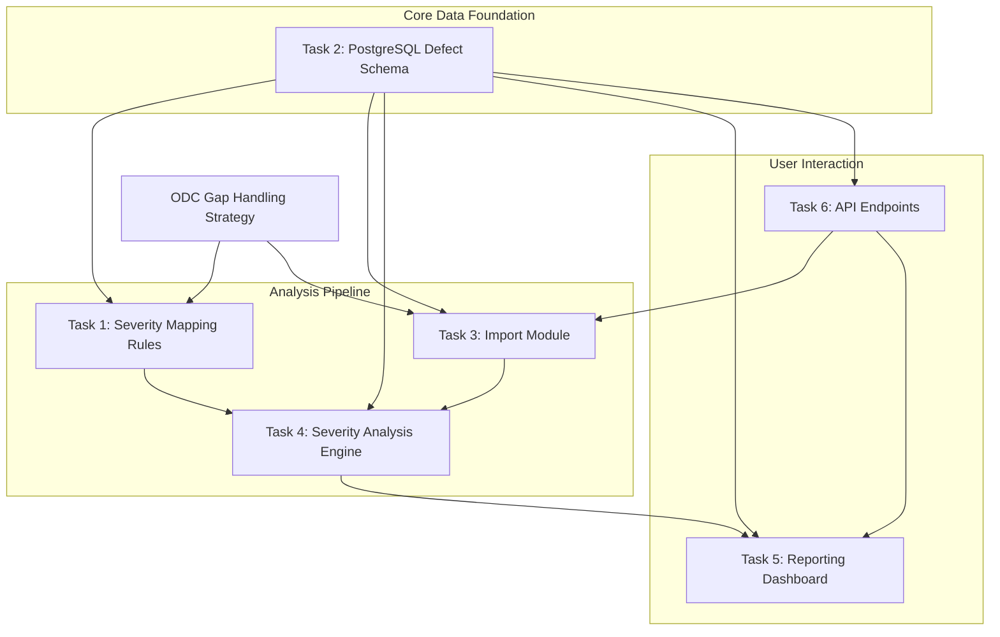

# Task Dependency Flowchart for DefectXray MVP

## Purpose
This document provides a visual representation and explanation of the dependencies between tasks for the DefectXray MVP, ensuring proper sequencing during the Execution phase starting in June 2025. It helps identify critical paths and prerequisites for efficient development.

## Flowchart Representation
Below is a textual representation of the task dependency flowchart using Mermaid syntax, which can be rendered in compatible Markdown viewers for a visual diagram. The flowchart illustrates how tasks depend on each other for completion.

## Explanation of Dependencies
- **Task 2 (PostgreSQL Defect Schema)**: Foundational task required by all others. It defines the data structure for storing defect data and ODC metadata, making it a prerequisite for:
  - **Task 1 (Severity Mapping Rules)**: Needs schema to store rules and override logs.
  - **Task 3 (Import Module)**: Requires schema for normalizing and storing imported data.
  - **Task 4 (Severity Analysis Engine)**: Depends on schema for data access and rule application.
  - **Task 5 (Reporting Dashboard)**: Needs schema for querying defect data.
  - **Task 6 (API Endpoints)**: Relies on schema for data validation and storage.
- **Task 1 (Severity Mapping Rules)**: Must precede:
  - **Task 4 (Severity Analysis Engine)**: Provides the rules for severity classification.
- **Task 3 (Import Module)**: Must precede:
  - **Task 4 (Severity Analysis Engine)**: Supplies defect data for analysis.
- **Task 4 (Severity Analysis Engine)**: Must precede:
  - **Task 5 (Reporting Dashboard)**: Provides processed severity and ODC data for visualization.
- **Task 6 (API Endpoints)**: Supports:
  - **Task 3 (Import Module)**: Provides endpoints for data ingestion.
  - **Task 5 (Reporting Dashboard)**: Supplies endpoints for data querying.
- **ODC Gap Handling Strategy (cline_docs/odc_gap_handling.md)**: Provides heuristic rules for:
  - **Task 1 (Severity Mapping Rules)**: For handling missing ODC metadata in severity calculation.
  - **Task 3 (Import Module)**: For inferring ODC attributes during data import.

## Critical Path Analysis
- **Critical Path**: Task 2 → Task 3 → Task 4 → Task 5
  - This sequence represents the core pipeline from data storage to import, analysis, and reporting, which must be completed in order for the MVP to function end-to-end.
- **Parallelizable Tasks**: Task 1 and Task 3 can be developed concurrently after Task 2, as can Task 6 (API Endpoints) to support both import and dashboard needs.

## Sequencing for Execution Phase
- **Phase 1 (June 2025)**: Start with Task 2 (PostgreSQL Schema) as the foundation. Begin Task 1 (Severity Rules) and Task 6 (API Endpoints) in parallel once schema basics are defined.
- **Phase 2 (Late June 2025)**: Proceed with Task 3 (Import Module) using schema and API endpoints, alongside continued work on Task 1.
- **Phase 3 (July 2025)**: Focus on Task 4 (Severity Analysis Engine) once Tasks 1 and 3 are nearing completion, preparing data for Task 5 (Reporting Dashboard).
- **Phase 4 (Late July 2025)**: Finalize Task 5 (Dashboard) and ensure Task 6 (API Endpoints) integrates fully with import and reporting components for beta testing.

## Review and Validation
- **Dependency Analysis**: Conduct analysis using `show-dependencies` command by May 15, 2025, to confirm no circular dependencies or missing prerequisites in tracker files.
- **Team Review**: Schedule a review of this flowchart with the development team by June 2025 to validate sequencing and adjust timelines if necessary.

## Timeline
- **May 2025**: Finalize flowchart and integrate dependencies into task instructions.
- **June 2025**: Review with team and adjust Execution phase plan based on feedback.

## Dependencies
- Relies on accurate dependency data from `module_relationship_tracker.md` and task instructions (Tasks 1-6).

## Changelog
- May 2025: Initial draft created during Strategy phase to map task dependencies for DefectXray MVP. 